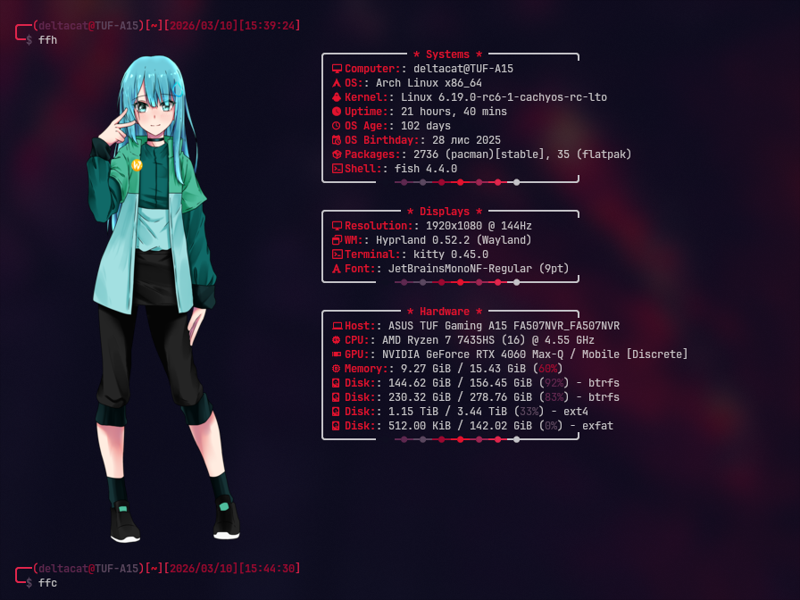

## Aliases:

**Навігація:**
- `..` / `...` / `....` — переміщення на 1-5 рівнів вгору
- `dl` / `doc` / `dt` — швидкий перехід до Downloads / Documents / Desktop

**Утиліти:**
- `ls` / `la` / `ll` / `lt` / `ld` — варіанти `eza` з іконками
- `cat` — `bat` з заголовком і підсвіткою змін
- `grep` / `egrep` / `fgrep` — через `ugrep` з кольором
- `please` — `sudo`
- `reload` — перезавантажити конфіг fish

**Fastfetch:**
- `ff` — стандартний Arch логотип
- `ffh` / `ffhg` — Hyprland / Hyprland Gruvbox
- `ffm` / `ffnya` — Myst / NyArch
- `ffc` / `ffn` / `fffire` / `ffap` / `ffmesa` / `ffkaboom` / `ffbh` — ASCII шаблони з кольором

**Розваги:**
- `neo` — Matrix ефект
- `bonsai` — живе дерево бонсай
- `quarium` — ASCII акваріум
- `rick` — Rick Roll в терміналі
- `map` — інтерактивна карта світу в терміналі

**DeltaCat Scripts (`dcs-`):**
- `dcs-health-analyze` — стан батареї та SSD
- `dcs-grub-edit` / `dcs-grub-upgrade` / `dcs-cmdline` — керування GRUB
- `dcs-pacman-edit` / `dcs-clear-pkg` / `dcs-pacman-unlock` — керування pacman
- `dcs-dracut-rebuild` — перебудова initramfs
- `dcs-fish-edit` — редагування конфігу fish
- `dcs-rf-unblock` — розблокування WiFi 
-  `dcs-fix-lock` виправлення локскріну hyprland
- `dcs-mon-start` / `dcs-mon-stop` — monitor mode для wlp3s0
- `dcs-hashcat-*` — керування hashcat сесіями та паролями
- `dcs-folders-setup` — створення стандартної структури папок

## Screenshots:

