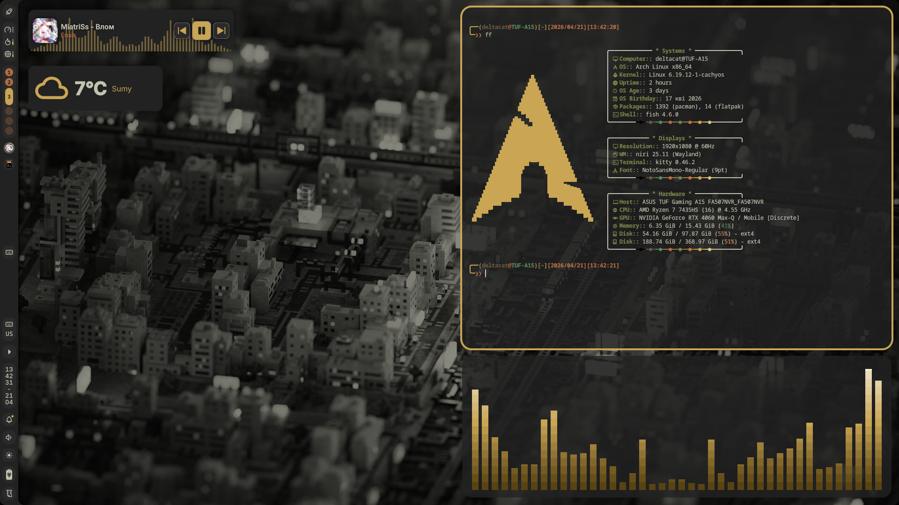
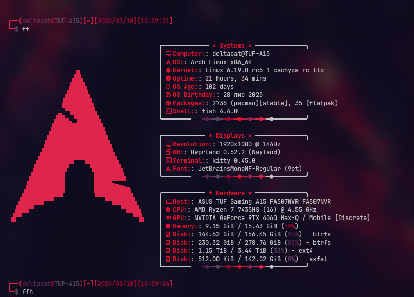
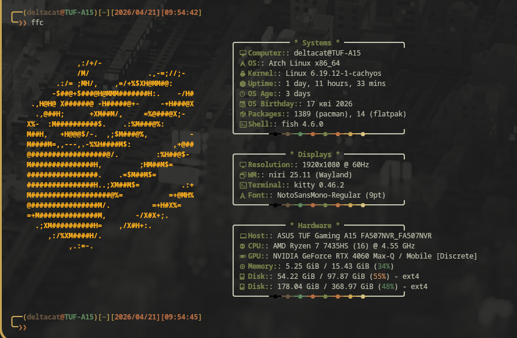
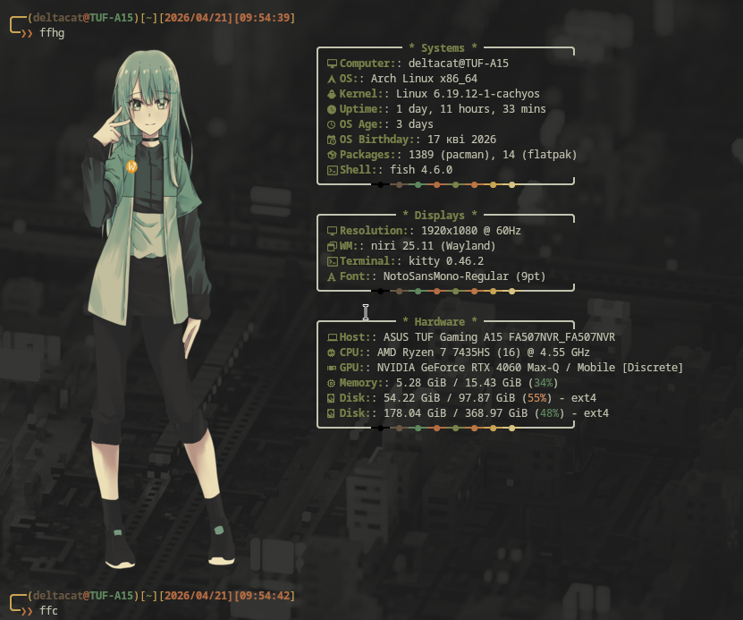

## Aliases

**Навігація:**
- `..` / `...` / `....` - переміщення на 1-5 рівнів вгору
- `dl` / `doc` / `dt` / `gt` - швидкий перехід до Downloads / Documents / Desktop / ~/my-files/my-git-repos

**Утиліти:**
- `ls` / `la` / `ll` / `lt` / `ld` / `lsz` - варіанти `eza` з іконками
- `cat` - `bat` з заголовком і підсвіткою змін
- `grep` / `egrep` / `fgrep` - через `ugrep` з кольором
- `please` - `sudo`
- `reload` - перезавантажити конфіг fish

**Git арбревіації**
- `gt-init` - ініціалізація репозиторію
- `gt-status` - статус репозиторію
- `gt-add-all` - додає в комміт всі файли репо
- `gt-commit` - створює комміт
- `gt-push` - вивантажує комміт
- `gt-pull` - завантажує оновлення репозиторію(треба бути в потрібному репозиторії)
- `gt-log` - логи
- `gt-save-pass` - зберігає данні для відвантаження(Username, Personal Access Token) у credential store
- `gt-setup` - швидке розгортування репозиторію
- `gt-fastcommit` - швидке вивантаження комміту

**Mirrors:**
- `mir-arch` / `mir-blac` / `mir-chao` - оновлення mirrorlist для Arch / BlackArch / Chaotic репозиторіїв
- `mir-cach` / `mir-cach3` / `mir-cach4` - оновлення mirrorlist для CachyOS репозиторіїв

**Fastfetch:**
- `ff` - стандартний Arch логотип
- `ffh` / `ffhg` - Hyprchan(Hina) / Hina Gruvbox
- `ffm` / `ffnya` - Myst / NyArch
- `ffc` / `ffn` / `fffire` / `ffap` / `ffmesa` / `ffkaboom` / `ffbh` - ASCII з фіналу гри Portal

**Розваги:**
- `neo` - Matrix ефект
- `bonsai` - живе дерево бонсай
- `quarium` - ASCII акваріум
- `rick` - Rick Roll в терміналі
- `map` - інтерактивна карта світу в терміналі

**DeltaCat Scripts (`dcs-`):**
> Зроблено для швидкого використання комманд через dcs- +Tab
- `dcs-health-analyze` - стан батареї та SSD
- `dcs-grub-edit` / `dcs-grub-upgrade` / `dcs-grub-cmdline` - керування GRUB
- `dcs-pacman-edit` / `dcs-pacman-clear` / `dcs-pacman-unlock` - керування pacman
- `dcs-dracut-rebuild` - перебудова initramfs
- `dcs-btrfs-balace` - балансування BTRFS розділу
- `dcs-fish-edit` - редагування конфігу fish
- `dcs-rf-unblock` - розблокування WiFi
- `dcs-mon-start` / `dcs-mon-stop` - monitor mode для wlp3s0
- `dcs-hashcat-*` - керування hashcat сесіями та паролями
- `dcs-folders-setup` - створення стандартної структури папок
- `dcs-dependencies-setup` - встановлення основних залежностей
- `dcs-rust-setup` - встановлення Rust з підтримкою Android (aarch64)
- `dcs-rust-aarch-build` / `dcs-rust-aarch-build-rel` - збірка під aarch64-linux-android
- `dcs-rustbookua-setup` - встановлення rustbook з українським перекладом
- `dcs-rustbookua` - запуск rustbook

**Screenshots:**

