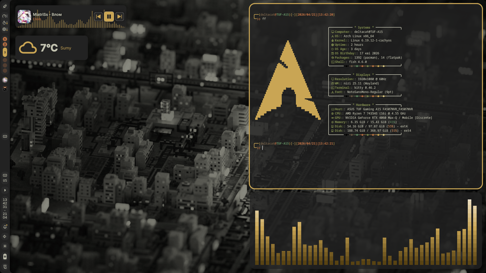
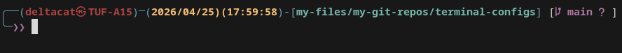
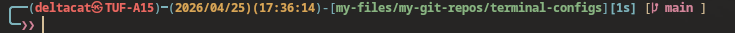
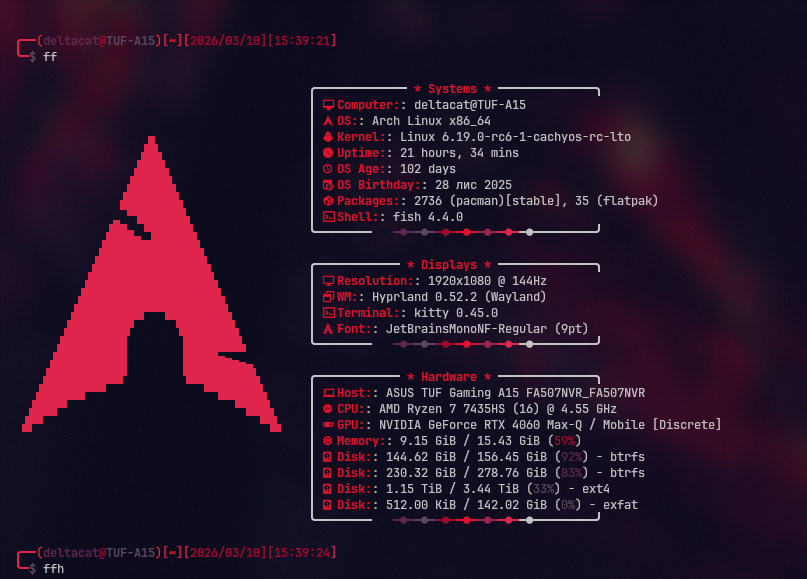
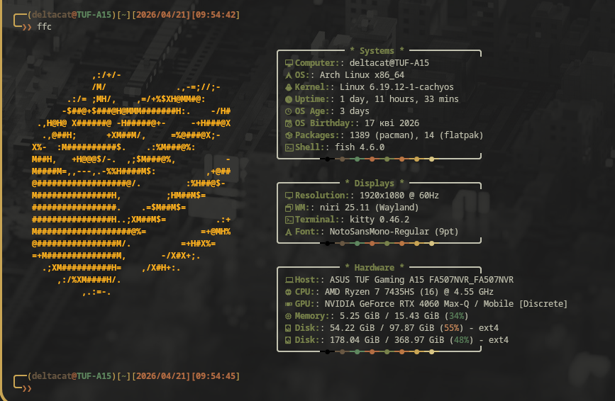
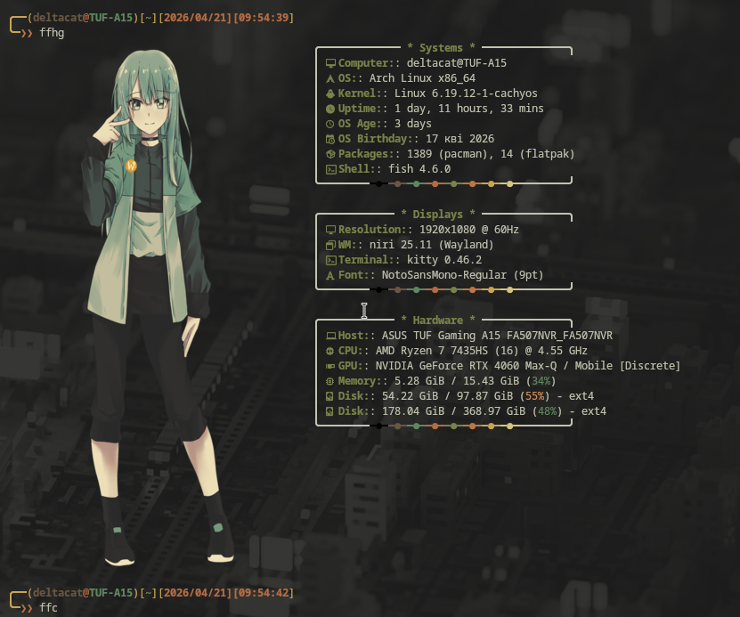

## Aliases

**Навігація:**
- `..` / `...` / `....` - переміщення на 1-5 рівнів вгору
- `dl` / `doc` / `dt` / `gt` - швидкий перехід до Downloads / Documents / Desktop / ~/my-files/my-git-repos

**Утиліти:**
- `ls` / `la` / `ll` / `lt` / `ld` / `lsz` - варіанти `eza` з іконками
- `cat` - `bat` з заголовком і підсвіткою змін
- `grep` / `egrep` / `fgrep` - через `ripgrep`
- `please` - `sudo`
- `reload` - перезавантажити конфіг fish
- `rm-full` - повне видалення(затирання данних через dd + rm -rf)
- `at` - `sudo apt install`(по іншому не пояснити)
- `pip-inst` - інсталяція ліби через pip

**Архіви**
- `tarnow` / `7znow` - запакувати архів 
- `untar` / `un7z` - розпакувати архів

**journalctl** (незабаром буде)
- `jlog`
- `jlog-` 
- `jlog-`
- `jlog-`

**AUR арбревіації**
- `aur-clone ` - заготовка комманди для клонування AUR репозиторію
- `aur-push` - швидке вивантаження оновлення
- `aur-build` - збірка
- `aur-check` - перевірка правильності PKGBUILD через namcap 
- `aur-srcinfo` - збірка .SRCINFO

**Git арбревіації**
- `gt-init` - ініціалізація репозиторію
- `gt-status` - статус репозиторію
- `gt-add-all` - додає в комміт всі файли репо
- `gt-commit` - створює комміт
- `gt-push` - вивантажує комміт
- `gt-pull` - завантажує оновлення репозиторію(треба бути в потрібному репозиторії)
- `gt-log` - логи
- `gt-setup` - швидке розгортування репозиторію
- `gt-fastcommit` - швидке вивантаження комміту
- `dcs-git-ssh-setup` - налаштування SSH ключа

**Mirrors:**
- `mir-arch` / `mir-blac` / `mir-chao` - оновлення mirrorlist для Arch / BlackArch / Chaotic репозиторіїв
- `mir-cach` / `mir-cach3` / `mir-cach4` - оновлення mirrorlist для CachyOS репозиторіїв

**Fastfetch:**
- `ff` - frastfetch
- `ffa` - покращене лого arch
- `ffh` / `ffhg` - Hyprchan(Hina) / Hina Gruvbox
- `ffm` / `ffnya` - Myst / NyArch
- `ffc` / `ffn` / `fffire` / `ffap` / `ffmesa` / `ffkaboom` / `ffbh` - ASCII з фіналу гри Portal

**Просто цікаві тулзи**
- `code-photo` - заготовка для створення фото коду через freeze 
- `netorbit` - відслідковування трафіку на мапі світу
- `gowall-list` - доступні палітри кольорів 
- `gowall-edit` - переробка шпалер під іншу кольорову палітру 

**Розваги:**
- `neo` - Matrix ефект
- `bonsai` - живе дерево бонсай
- `quarium` - ASCII акваріум
- `rick` - Rick Roll анімація
- `map` - інтерактивна карта світу ASCII
- `tetris-sand` - пісочний тетріс

**DeltaCat Scripts (`dcs-`):**
> Зроблено для швидкого використання комманд через dcs- +Tab
- `dcs-health-analyze` - стан батареї та SSD
- `dcs-grub-edit` / `dcs-grub-upgrade` / `dcs-grub-cmdline` - керування GRUB
- `dcs-pacman-edit` / `dcs-pacman-clear` / `dcs-pacman-unlock` - керування pacman
- `dcs-dracut-edit` / `dcs-dracut-conf` - редагування та вивід /etc/dracut.conf.d/myflags.conf
- `dcs-nvmodprobe-edit` / `dcs-nvmodprobe-conf` - редагування та вивід /etc/modprobe.d/nvidia.conf
- `dcs-btrfs-balace` - балансування BTRFS розділу
- `dcs-fish-edit` - редагування конфігу fish
- `dcs-rf-unblock` - розблокування WiFi
- `dcs-mon-start` / `dcs-mon-stop` - monitor mode для wlp3s0
- `dcs-hashcat-*` - керування hashcat сесіями та паролями
- `dcs-folders-setup` - створення стандартної структури папок
- `dcs-dependencies-setup` - встановлення основних залежностей
- `dcs-rust-setup` - встановлення Rust з підтримкою Android (aarch64)
- `dcs-rust-aarch-build` / `dcs-rust-aarch-build-rel` - збірка під aarch64-linux-android
- `dcs-rustbookua-setup` - встановлення rustbook з українським перекладом
- `dcs-rustbookua` - запуск rustbook

**DeltaCat Scripts Ports**
- [emerge](https://github.com/Undercat037/aura-emerge)
- `dcs-dracut-rebuild` - перебудова initramfs(портований скрипт з garuda)
- `dcs-garuda-update` - повне оновлення системи (порт garuda-update)(кейрінги, дзеркала, пакети, dkms, initramfs(dracut), grub) Флаги: --aur, --skip-mirrorlist

**Screenshots:**

